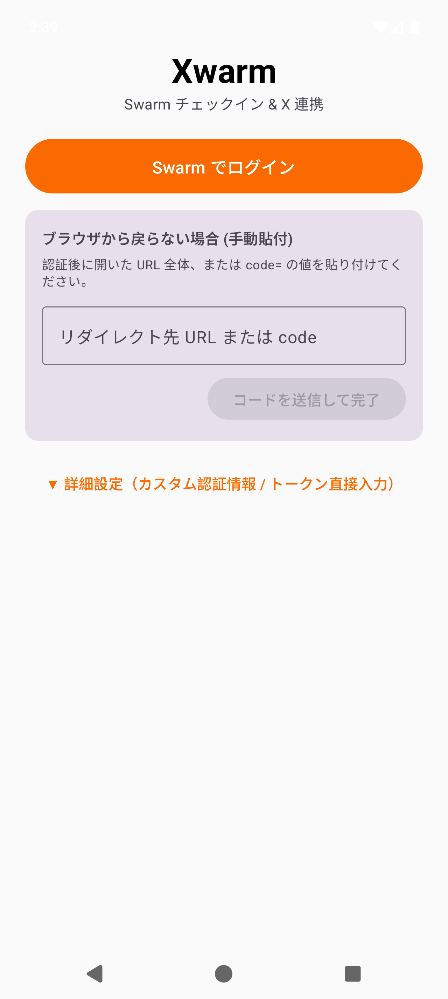
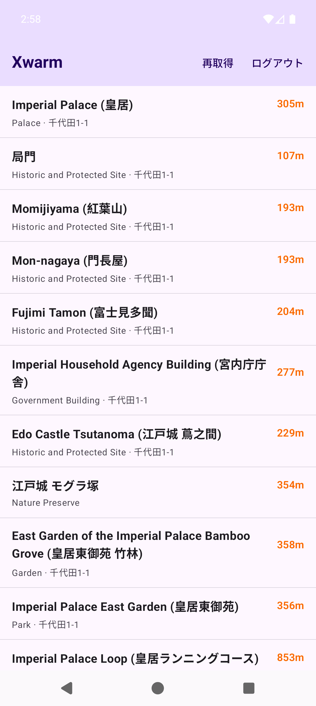

# Xwarm

Swarm（旧 Foursquare）チェックイン & X（Twitter）共有特化の Android アプリケーション。

[](https://github.com/Masterisk-F/xwarm/actions)

---

## 概要

アプリを起動すると、現在地周辺のスポット一覧を即座に表示します。
スポットを**長押しするだけ**で Swarm にチェックインし、そのまま投稿文が入った状態で **X アプリの投稿画面** を起動します。

```
I'm at [スポット名] in [都市, 州 または 住所]
[Swarm 共有URL]
```

## スクリーンショット

<p align="center">
  
  &nbsp;&nbsp;&nbsp;&nbsp;
  
</p>

### 主な特徴

- 🚀 **起動即一覧**: アプリを開くだけで、GPS を用いて周辺のスポット（会場名・現在地からの距離・カテゴリ・住所）を表示
- 🔄 **スワイプ再測位**: リストを下方向にスワイプすると、現在地を再測位して一覧を最新化
- 👆 **長押しチェックイン**: スポット行を長押しするだけで素早くチェックイン完了
- 🐦 **X (Twitter) 連動**: チェックイン完了後、公式 Web Intent 経由で X アプリを起動（本文・URL 入力済み）
- 🔁 **連続チェックイン**: 1 回チェックインした後、アプリに戻れば何度でも他のスポットへ続けてチェックイン可能
- 🔐 **セキュア & 認証情報の分離**: `client_secret` などの秘密情報はソースコードや公開リポジトリには一切含めず、`local.properties` または初回起動画面から安全に入力・暗号化保存（EncryptedSharedPreferences）

---

## Foursquare 連携キーの取得

FoursquareのDeveloper Colsoleから`client_id` / `client_secret`を取得してください。

1. [Foursquare Developer Console](https://location.foursquare.com/developer/) にアクセスし、無料アカウントを作成またはログインします。
2. 利用規約（Places API Pay-As-You-Go Terms of Use）に同意します（クレジットカード登録は不要です）。
   - ※ Chrome で同意チェックボックスが押せない場合は、Firefox 等の別ブラウザをお試しください。
3. **「Create New Project」** から新規プロジェクトを作成します。
4. **Redirect URL** に `xwarm://oauth/callback`を登録します。
5. **Project Settings → OAuth Authentication** から **Client ID** と **Client Secret** を確認・コピーします。

---

## ビルド & インストール手順

### 1. リポジトリのクローン

```bash
git clone https://github.com/Masterisk-F/xwarm.git
cd xwarm
```

### 2. 認証情報の設定 (`local.properties`)

プロジェクト直下の `local.properties`（git 管理外）に取得したキーを記述します：

```properties
sdk.dir=/path/to/your/Android/Sdk

FSQ_CLIENT_ID=your_client_id_here
FSQ_CLIENT_SECRET=your_client_secret_here
FSQ_REDIRECT_URI=xwarm://oauth/callback
```

> **※ `local.properties` にキーを書かずにビルドした場合でも、アプリ初回起動時の設定画面から Client ID / Secret または OAuth Token を直接入力して利用可能です。**

### 3. ビルドとインストール

```bash
# デバッグ APK のビルド
./gradlew assembleDebug

# 接続中の実機 / エミュレータへインストール
adb install -r app/build/outputs/apk/debug/app-debug.apk
```

### 4. 初回起動とログイン

1. アプリを起動し、位置情報の利用を許可します。
2. 「**Swarm でログイン**」ボタンをタップし、ブラウザで Foursquare アカウントのアクセスを許可します。
3. 認証が完了すると自動的にスポット一覧画面へ遷移します。

---

## 動作要件

- Android 7.0 (API レベル 24) 以上
- compileSdk 35 / targetSdk 35
- OpenJDK 17 以上 (ビルド環境)
- Gradle 8.13

---

## アーキテクチャ & 実装詳細

- **UI**: Jetpack Compose (Material 3, Material 3 PullToRefreshBox, `Modifier.combinedClickable`)
- **非同期処理**: Kotlin Coroutines + StateFlow / SharedFlow
- **ネットワーク**: OkHttp 4.12
- **暗号化保存**: `androidx.security:security-crypto` (EncryptedSharedPreferences + MasterKey AES256-GCM)
- **API 系統の使い分け**:
  - 近隣スポット検索: Foursquare Places API (`GET https://places-api.foursquare.com/geotagging/candidates`)
  - チェックイン作成: Foursquare v2 API (`POST https://api.foursquare.com/v2/checkins/add?v=20221002`)

---

## ライセンス

[GPL-3.0](LICENSE)
